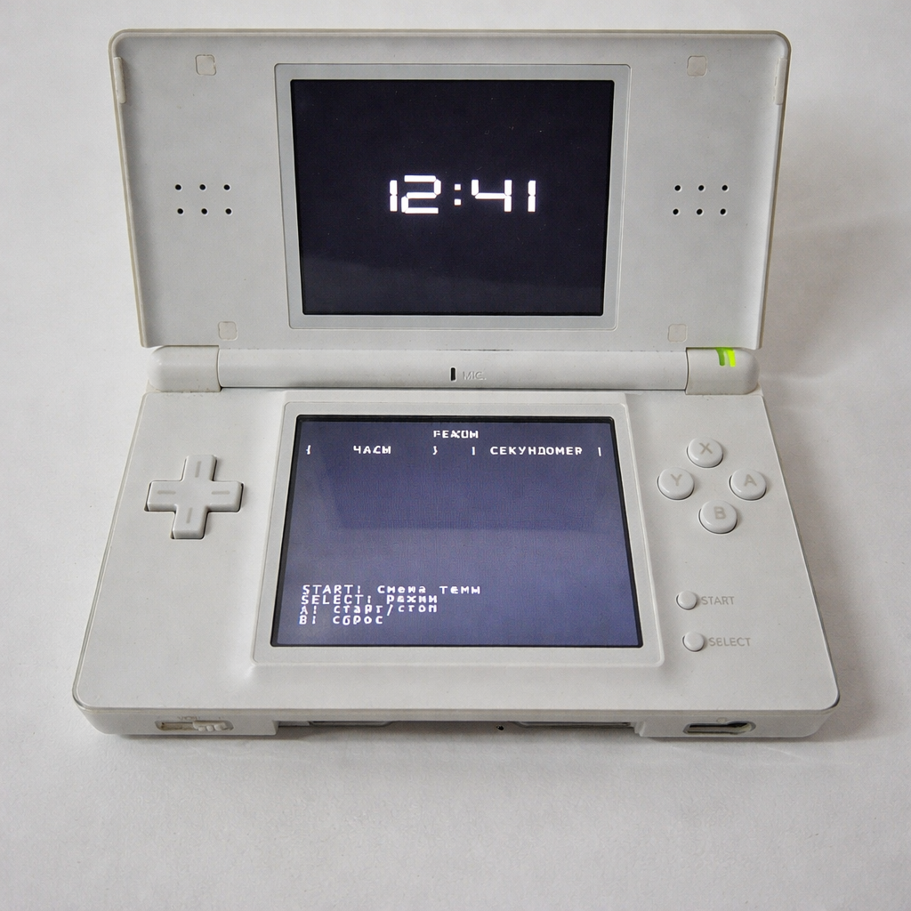
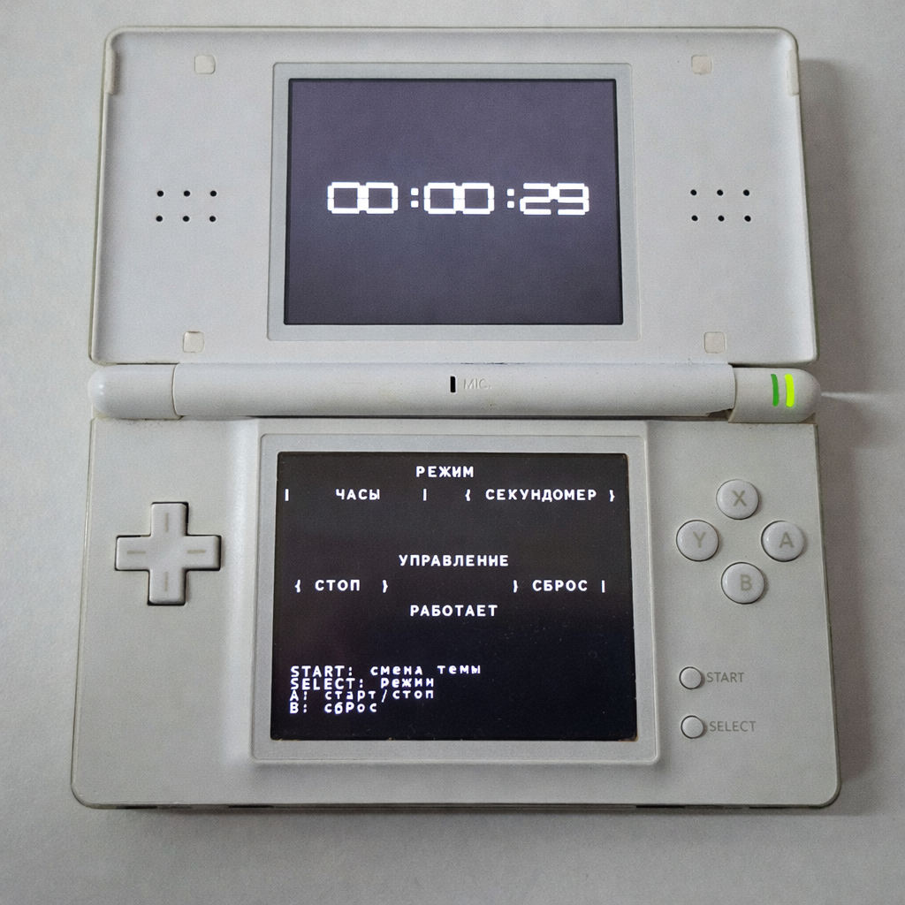

# Organizer для Nintendo DS

Минималистичный органайзер для Nintendo DS с двумя режимами:
- часы,
- секундомер.

Проект написан на C с использованием `libnds` (ARM9), интерфейс разделён между двумя экранами:
- верхний экран: крупное время (спрайты),
- нижний экран: текстовый UI, кнопки режимов и подсказки управления.

## Важно: эмулятор

Поддерживается запуск в **melonDS**.

`DeSmuME` **не поддерживается** для этого проекта.

Для сохранений (`organizer.sav`) в `melonDS` должен быть включён `DLDI`.

## Возможности

- Отображение текущего времени в режиме часов.
- Секундомер с запуском, паузой и сбросом.
- Переключение светлой/тёмной темы.
- Выбор языка при первом запуске.
- Сохранение выбранного языка в `organizer.sav`.
- Подключение языков из файлов `locales/*.lng` (новый файл = новый язык в меню).
- Управление как кнопками консоли, так и сенсорным экраном.

## Управление

- `START` — переключить тему (светлая/тёмная).
- `SELECT` — переключить режим (`Часы` / `Секундомер`).
- `L+R` — открыть/закрыть экран `Settings`.
- `A` — старт/стоп секундомера (в режиме секундомера).
- `B` — сброс секундомера (в режиме секундомера).
- `UP/DOWN + A` — выбор языка на экране первичной настройки.
- В `Settings`: `A` — выбрать язык, `B` — назад.
- Touch-кнопки `Часы` / `Секундомер` — переключение режима.
- Touch-кнопки `Старт/Стоп` и `Сброс` — управление секундомером.

## Скриншоты





## Структура проекта

- `source/main.c` — точка входа, запускает приложение через `appRun()`.
- `source/app.c` — основной цикл, обработка ввода, логика режимов и состояния.
- `source/save.c` — чтение/запись `organizer.sav`.
- `source/localization.c` — загрузка языков из `NitroFS`, парсинг `.lng` и выбор текущего языка.
- `source/ui.c` — нижний экран: текстовый интерфейс, кнопки и hit-тест touch-событий.
- `source/top_display.c` — верхний экран: отрисовка времени крупными спрайт-цифрами.
- `include/app.h` — общие типы состояния (`AppState`, `AppMode`, `Theme`) и API приложения.
- `include/save.h` — API сохранения настроек.
- `include/localization.h` — API локализации и языков.
- `include/ui.h` — API UI и действия (`UiAction`).
- `include/top_display.h` — API верхнего экрана.
- `locales/` — файлы локализаций (`*.lng`).
- `gfx/` — графические ресурсы (`font`, `digits`) и `.grit`-описания.
- `tools/ttf2nds.py` — генерация bitmap-шрифтов из TTF.
- `Makefile` — полная сборка `.nds`, генерация ресурсов и артефактов.

## Локализации

Языки загружаются из `NitroFS` (`nitro:/locales`).
Во время `make` файлы из `locales/*.lng` автоматически упаковываются в ROM.
Добавьте новый файл `locales/<id>.lng` и пересоберите проект — язык появится в меню выбора.

Система локализаций работает в строгом режиме:
- все ключи обязательны,
- нет встроенных fallback-строк,
- невалидные `.lng`-файлы игнорируются,
- если валидных языков нет, приложение показывает экран ошибки локализации.

Для расширения набора строк используется единый список полей `LOCALIZATION_FIELD_MAP` в `include/localization.h`.  
Добавление нового ключа делается в одном месте:
1. добавить строку в `LOCALIZATION_FIELD_MAP`,
2. добавить ключ во все `locales/*.lng`,
3. использовать новое поле в UI/логике.

Файлы локализации можно хранить в UTF-8. Для экранного шрифта строки автоматически конвертируются в CP1251.

Поддерживаемые ключи в `.lng`:

- `name`
- `mode_title`
- `mode_clock`
- `mode_stopwatch`
- `control_title`
- `action_start`
- `action_stop`
- `action_reset`
- `status_run`
- `status_pause`
- `settings_title`
- `settings_language`
- `settings_hint_a`
- `settings_hint_b`
- `settings_hint_lr`
- `language_select_title`
- `language_select_hint`
- `hint_start`
- `hint_select`
- `hint_a`
- `hint_b`
- `hint_lr`

Пример:

```ini
name=English
mode_title=Mode
mode_clock=Clock
mode_stopwatch=Stopwatch
control_title=Controls
action_start=Start
action_stop=Stop
action_reset=Reset
status_run=Running
status_pause=Paused
settings_title=Settings
settings_language=Language
settings_hint_a=A: choose language
settings_hint_b=B: back
settings_hint_lr=L+R: close settings
language_select_title=Select language
language_select_hint=UP/DOWN + A to select
hint_start=START: toggle theme
hint_select=SELECT: switch mode
hint_a=A: start/stop
hint_b=B: reset
hint_lr=L+R: settings
```

## Сборка

### Зависимости

Нужны инструменты из devkitPro:
- `devkitARM`
- `libnds`
- `libfat`
- `grit`

Также:
- `python3` (для `tools/ttf2nds.py`)

Переменная окружения `DEVKITARM` должна быть установлена.

Пример (путь адаптируйте под свою систему):

```bash
export DEVKITPRO=/opt/devkitpro
export DEVKITARM=$DEVKITPRO/devkitARM
```

### Команды

Собрать проект:

```bash
make
```

Что делает `make`:
- очищает предыдущие артефакты,
- генерирует `gfx/font.png` и `gfx/digits.png`,
- синхронизирует `locales/*.lng` в `NitroFS`,
- компилирует исходники,
- собирает ROM `dist/organizer.nds`,
- копирует файлы локализаций в `dist/locales/*.lng`.

Очистить артефакты:

```bash
make clean
```

## Выходные файлы

- `dist/organizer.nds` — готовый ROM для запуска в `melonDS`.
- `dist/organizer.elf` — ELF-артефакт сборки.

## Запуск

1. Откройте `melonDS`.
2. Загрузите `dist/organizer.nds`.
3. Используйте клавиши и touch-управление согласно разделу «Управление».
