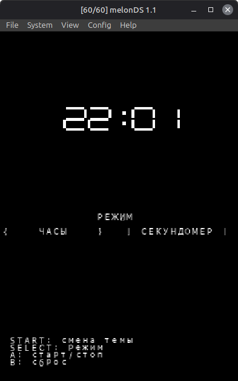
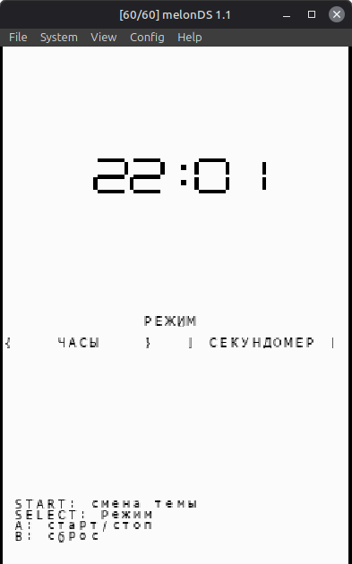
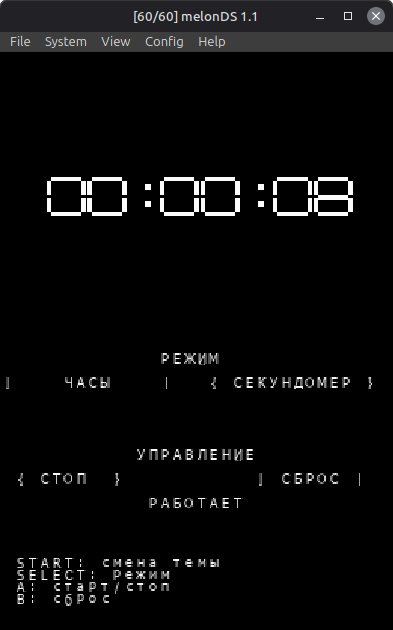
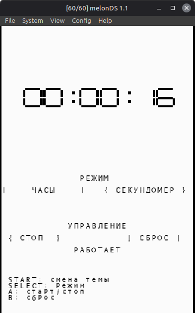

# Organizer для Nintendo DS

Минималистичный органайзер для Nintendo DS с двумя режимами:
- часы,
- секундомер.

Проект написан на C с использованием `libnds` (ARM9), интерфейс разделён между двумя экранами:
- верхний экран: крупное время (спрайты),
- нижний экран: текстовый UI, кнопки режимов и подсказки управления.

## Важно: эмулятор

Поддерживается запуск в **melonDS**.

`DeSmuME` **не поддерживается** для этого проекта.

## Возможности

- Отображение текущего времени в режиме часов.
- Секундомер с запуском, паузой и сбросом.
- Переключение светлой/тёмной темы.
- Управление как кнопками консоли, так и сенсорным экраном.

## Управление

- `START` — переключить тему (светлая/тёмная).
- `SELECT` — переключить режим (`Часы` / `Секундомер`).
- `A` — старт/стоп секундомера (в режиме секундомера).
- `B` — сброс секундомера (в режиме секундомера).
- Touch-кнопки `Часы` / `Секундомер` — переключение режима.
- Touch-кнопки `Старт/Стоп` и `Сброс` — управление секундомером.

## Скриншоты

- `screenshots/01-clock-dark-theme.png` — часы, тёмная тема.
- `screenshots/02-clock-light-theme.png` — часы, светлая тема.
- `screenshots/03-stopwatch-dark-theme.png` — секундомер, тёмная тема.
- `screenshots/04-stopwatch-light-theme.png` — секундомер, светлая тема.






## Структура проекта

- `source/main.c` — точка входа, запускает приложение через `appRun()`.
- `source/app.c` — основной цикл, обработка ввода, логика режимов и состояния.
- `source/ui.c` — нижний экран: текстовый интерфейс, кнопки и hit-тест touch-событий.
- `source/top_display.c` — верхний экран: отрисовка времени крупными спрайт-цифрами.
- `include/app.h` — общие типы состояния (`AppState`, `AppMode`, `Theme`) и API приложения.
- `include/ui.h` — API UI и действия (`UiAction`).
- `include/top_display.h` — API верхнего экрана.
- `gfx/` — графические ресурсы (`font`, `digits`) и `.grit`-описания.
- `tools/ttf2nds.py` — генерация bitmap-шрифтов из TTF.
- `Makefile` — полная сборка `.nds`, генерация ресурсов и артефактов.

## Сборка

### Зависимости

Нужны инструменты из devkitPro:
- `devkitARM`
- `libnds`
- `grit`

Также:
- `python3` (для `tools/ttf2nds.py`)

Переменная окружения `DEVKITARM` должна быть установлена.

Пример (путь адаптируйте под свою систему):

```bash
export DEVKITPRO=/opt/devkitpro
export DEVKITARM=$DEVKITPRO/devkitARM
```

### Команды

Собрать проект:

```bash
make
```

Что делает `make`:
- очищает предыдущие артефакты,
- генерирует `gfx/font.png` и `gfx/digits.png`,
- компилирует исходники,
- собирает ROM `dist/organizer.nds`.

Очистить артефакты:

```bash
make clean
```

## Выходные файлы

- `dist/organizer.nds` — готовый ROM для запуска в `melonDS`.
- `dist/organizer.elf` — ELF-артефакт сборки.

## Запуск

1. Откройте `melonDS`.
2. Загрузите `dist/organizer.nds`.
3. Используйте клавиши и touch-управление согласно разделу «Управление».
